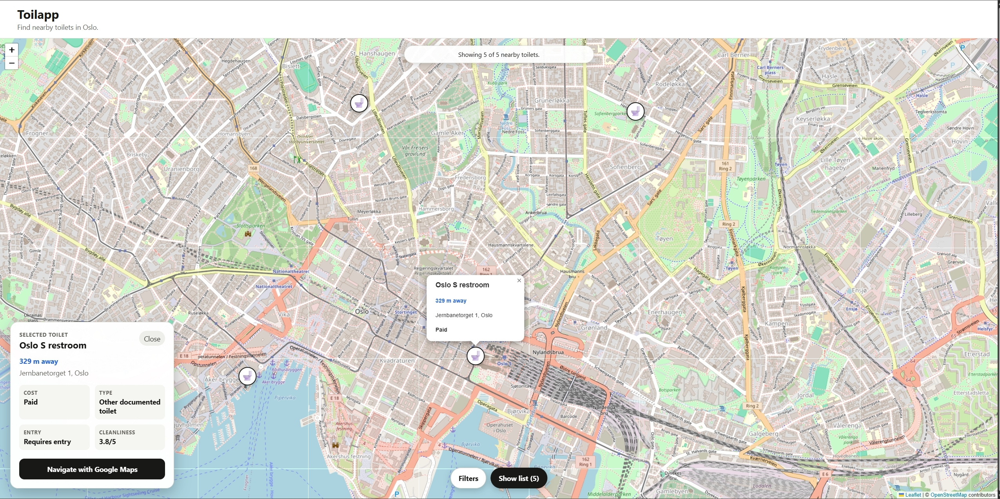
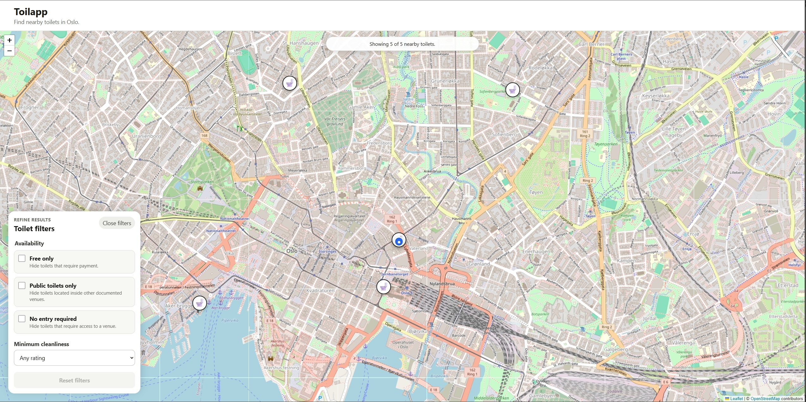
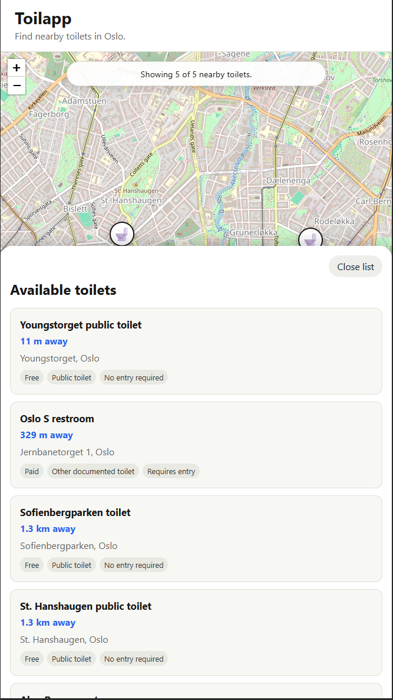

# Toilapp

A full-stack restroom finder that helps users locate nearby toilets, inspect relevant details and open walking directions in Google Maps.

<p align="center">
  
</p>

## Overview

Toilapp is a full-stack portfolio project built with Spring Boot, React and TypeScript.

The application uses browser geolocation to find nearby toilets, calculates straight-line distance, displays the results on an interactive map and allows users to filter and inspect the available toilets.

The current version focuses on Oslo and uses a seeded toilet dataset stored in PostgreSQL and served by the Spring Boot backend.

## Features

- Browser geolocation
- Graceful Oslo fallback when location access is unavailable
- Interactive map built with React Leaflet and OpenStreetMap
- Straight-line distance calculation
- Toilets restricted to a 2 km search radius
- Nearest-first result ordering
- Maximum of six displayed results
- Toilet selection from both map markers and list items
- Detailed toilet information:
  - address
  - straight-line distance
  - free or paid
  - public or other documented toilet
  - entry requirement
  - cleanliness rating
- Google Maps walking directions
- User-controlled filters:
  - free only
  - public toilets only
  - no entry required
  - minimum cleanliness rating
- Responsive desktop and mobile layouts
- Frontend unit and integration tests
- Backend controller, service, repository and seed-data tests

## Application preview

### Filter nearby toilets

Users can filter the displayed toilets by price, toilet type, entry requirements and minimum cleanliness rating.

<p align="center">
  
</p>

### Responsive toilet list

The toilet list adapts to smaller screens while retaining distance and availability information.

<p align="center">
  
</p>

## Technology stack

### Backend

- Java 21
- Spring Boot
- Spring Data JPA
- PostgreSQL
- Maven
- JUnit
- Mockito

### Frontend

- React
- TypeScript
- Vite
- React Leaflet
- Leaflet
- Vitest
- React Testing Library

### Map and navigation

- OpenStreetMap tiles
- Google Maps URLs for external walking directions

## Project structure

```text
restroom-finder/
├── backend/
│   ├── src/
│   ├── pom.xml
│   └── mvnw.cmd
├── frontend/
│   ├── src/
│   │   ├── api/
│   │   ├── components/
│   │   ├── hooks/
│   │   ├── test/
│   │   ├── types/
│   │   └── utils/
│   ├── package.json
│   └── vite.config.ts
├── docs/
│   └── images/
├── docker-compose.yml
├── .gitignore
└── README.md
```

## How the application works

1. PostgreSQL stores the toilet dataset.
2. Spring Boot reads toilet data through Spring Data JPA.
3. The React frontend requests the data from the REST API.
4. The browser is asked for the user's current position.
5. The frontend calculates straight-line distance to each toilet.
6. Toilets outside the 2 km radius are removed.
7. User-selected filters are applied.
8. Matching toilets remain ordered by distance.
9. A maximum of six toilets is displayed.
10. Selecting a map marker or list item opens a detail card.
11. Google Maps can be opened with the toilet as the walking destination.

## Design decisions

### Straight-line distance

The current version uses the Haversine formula to calculate straight-line distance.

This keeps the MVP independent of a paid or authenticated routing API. The calculated distance is useful for nearby filtering, but it is not the same as actual walking distance.

### Shared selection state

The selected toilet is stored in `App.tsx`.

This allows both the map and the list to open the same detail card without maintaining separate and potentially conflicting selection states.

### Filtering before the result limit

Every toilet inside the search radius is filtered before the displayed result is limited to six.

This prevents a matching toilet from being hidden simply because six closer toilets failed the selected filters.

### Separate filtering utilities

Geographical search and user-controlled filtering are implemented as separate utilities.

This keeps distance rules, filter rules and React presentation logic independently testable.

### External navigation

Toilapp generates a Google Maps URL with walking mode rather than implementing turn-by-turn navigation.

## Prerequisites

- Java 21
- Node.js and npm
- Docker
- Git

## Run PostgreSQL

Start the PostgreSQL service from the project root:

```powershell
docker compose up -d postgres
docker compose ps
```

The database name is `toilapp`, and PostgreSQL is available on port `5432`. Its data is stored in a named Docker volume and survives normal container restarts.

## Run the backend

### Windows

```powershell
cd backend
.\mvnw.cmd spring-boot:run
```

### macOS or Linux

```bash
cd backend
./mvnw spring-boot:run
```

The backend runs on:

```text
http://localhost:8080
```

Available endpoints:

```text
GET /api/toilets
GET /api/toilets/{id}
```

## Run the frontend

Open a separate terminal:

```powershell
cd frontend
npm install
npm run dev
```

Vite normally starts the frontend on:

```text
http://localhost:5173
```

If the port is occupied, Vite selects another available port.

## Run the tests

### Frontend tests

```powershell
cd frontend
npm run test
```

### Frontend production build

```powershell
cd frontend
npm run build
```

### Backend tests on Windows

```powershell
cd backend
.\mvnw.cmd test
```

### Backend tests on macOS or Linux

```bash
cd backend
./mvnw test
```

## Current limitations

- Toilet data is currently seeded in the backend.
- The dataset currently focuses on Oslo.
- Distances are straight-line estimates rather than walking-route distances.
- Opening hours are not yet included.
- Detailed accessibility information is not yet included.
- Cleanliness ratings are seeded values rather than user-generated ratings.
- The application does not yet include user accounts.
- Navigation is handed off to Google Maps.
- The application is not yet deployed publicly.

## Planned improvements

- A larger municipal or external toilet dataset
- Opening hours and availability status
- Wheelchair accessibility information
- Baby-changing facilities
- User ratings and reports
- Backend-driven geographical search
- Azure deployment
- GitHub Actions CI/CD
- Improved mobile map controls

## Testing approach

The frontend test suite covers:

- API loading and error states
- browser geolocation states
- distance calculations
- nearby-toilet search
- user-controlled filtering
- map and list result coordination
- toilet selection
- detail-card content
- Google Maps walking URLs

The backend tests cover the existing API, service and repository behavior, including seed-data persistence and duplicate prevention.

## Author

Built by Jens J. Bonten as a full-stack portfolio project.
